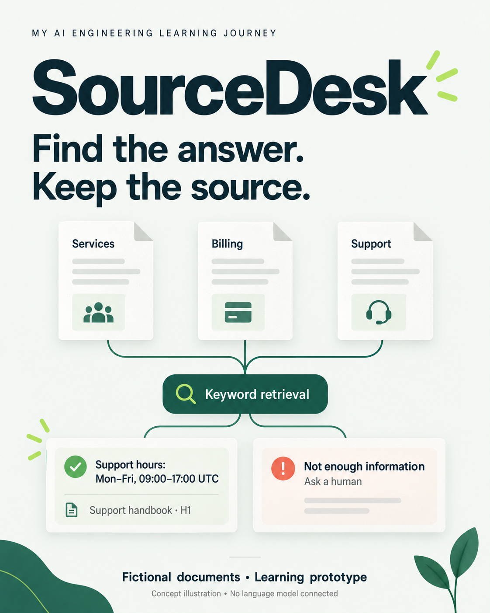

# SourceDesk

### Find the answer. Keep the source.

A document-grounded support prototype exploring a practical business automation problem: finding answers across scattered service, billing and support documents.

**Status:** Educational prototype · **Data:** Fictional · **Stack:** HTML, CSS and JavaScript



*Concept illustration generated with ImageGen; not a product screenshot.*

## Demo

[Try the live demo →](https://smarfaei.github.io/sourcedesk/)

Open `index.html` locally, or use the live website linked in this repository's **About** section after GitHub Pages is enabled. No installation or API key is needed.

## The problem

Customers repeatedly ask about services, payments and support availability. The relevant information may live in separate documents. SourceDesk explores how a small retrieval tool can bring those passages together while keeping their origins visible.

## What this version does

- Searches three fictional documents for relevant English keywords.
- Displays original document excerpts and clickable section references.
- Retrieves multiple sections when the question contains multiple topics.
- Shows a fallback when keyword coverage is insufficient.
- Runs locally in the browser without sending questions to a server.

This version has **no language model, embeddings or autonomous agent**. It is a lexical retrieval baseline for a future RAG learning project.

## Try these questions

| Question | Expected behavior |
| --- | --- |
| What are your support hours? | Retrieve Support handbook, H1 |
| What services do you offer and how do I get started? | Retrieve Services guide, S1 and S2 |
| What is your refund policy? | Retrieve Billing & cancellation, B4 |
| Will you offer discounts next month? | Show an insufficient-information message |

## How it works

```text
Question → normalize English keywords → rank document sections
                                       ↓
                             check keyword coverage
                                 ↙           ↘
                     source excerpts       fallback
                     with references       ask a human
```

A small synonym map normalizes terms. Sections are ranked by weighted keyword overlap. A coverage threshold determines whether to show up to three excerpts or a fallback. The response displays original text rather than generating new prose. Human handoff is a suggestion only; no message is sent.

## Project structure

```text
index.html                  Interactive demo and embedded knowledge base
documents/                  Readable copies of the fictional source documents
assets/project-cover.png    Concept illustration
validation.json             Recorded logic-check results and boundaries
LEARNING-LOG.md             Starting point and future observations
README.md                   Project overview
```

The runtime uses the documents embedded in `index.html`. The Markdown files are readable copies, not dynamically loaded inputs. Keep both versions in sync when changing the knowledge base.

## Validation

Ten selected retrieval/fallback questions passed automated logic checks on 16 September 2026. Basic rendering assembly, form handling and source selection were also checked using a minimal DOM substitute. These results do not establish general answer accuracy or browser compatibility.

Actual browser rendering and mobile layout have **not yet been visually verified** because browser launch/local preview were blocked in the preparation environment. See [`validation.json`](validation.json) for the exact checks. A question about paying by card also returns an extra payment passage, illustrating imperfect relevance.

## Known limitations

- English-only matching with a small vocabulary and fixed document set.
- Valid paraphrases may be rejected; overlapping keywords may retrieve irrelevant passages.
- A citation identifies the source but does not guarantee that it answers the question.
- No conversational memory, uploads, generated synthesis or live business integrations.
- No production evaluation or measured customer outcomes.

## Learning roadmap

- [x] Prepare a fictional business knowledge base.
- [x] Implement a keyword retrieval baseline with source references.
- [x] Check selected supported and unsupported questions.
- [ ] Verify desktop and mobile behavior in a real browser.
- [ ] Expand evaluation with paraphrases and ambiguous questions.
- [ ] Compare keyword retrieval with semantic retrieval.
- [ ] Explore a language model with citations and evaluate unsupported claims.

## Attribution

Prepared with Codex assistance as a learning starting point. The learner defined the project direction; the initial implementation, sample documents and checks were AI-assisted. Further hands-on review and findings can be recorded in the learning log. All business information is fictional; no affiliation or endorsement by a real business is implied.

## Feedback

To report an issue, include the question you asked, the retrieved section, what you expected, and your browser. Use fictional examples only.
